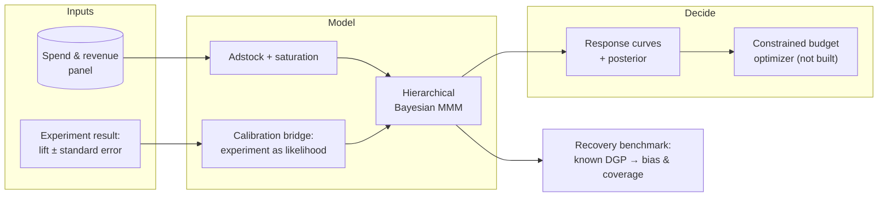

# liftlab

**Bayesian marketing mix modeling calibrated by geo-incrementality experiments — with a budget
optimizer that carries posterior uncertainty into the recommendation instead of discarding it.**

> **Status: in active development (v0.1.0).** The MMM core, the Israeli retail calendar, the
> synthetic DGP, the calibration bridge, and the parameter-recovery benchmark are in place. The
> budget optimizer is not built yet, and designing or analysing geo experiments is deliberately
> out of scope — see Architecture. Every number below is produced by a named command, and nothing
> is claimed until it has actually run.

## Why

Post-ATT attribution is broken, and most agencies still sell last-click ROAS. Marketing mix
modeling is the standard answer, but MMM alone is only weakly identified: many combinations of
carryover, saturation, and channel coefficient fit the same aggregate revenue series roughly as
well. Fitting one of them and reporting it as truth is the common failure mode.

The fix is to calibrate the model against experiments. An incrementality test gives a randomised
(or quasi-randomised) estimate of lift for one channel over one window — external information the
aggregate series does not contain. Folding it into the model is what Meta and Google do internally,
and it is rarely demonstrated end to end in public.

`liftlab` is that fold: **take a lift measurement you already have → let it constrain the MMM →
read the budget implications with the uncertainty intact.**

The benchmark below quantifies what that buys, on data where the right answer is known.

## Architecture



**`liftlab` does not run or analyse the experiment.** It consumes the result — an incremental
revenue estimate with a standard error — from wherever the test was actually measured: a geo
holdout, Meta Conversion Lift, a Google geo experiment, an in-house synthetic control. Designing
and analysing geo tests is a separate problem with mature tooling, and reimplementing it here would
add surface area without adding evidence.

## Results

Simulate from a known data-generating process, fit the model, and check two things: how far the
estimates land from truth, and whether the credible intervals cover at their nominal rate. Twelve
independent replications of three years of daily data across five channels.

```bash
just recover --profile full
```

| parameter | n | mean rel. bias | median abs rel. bias | coverage 95% | coverage 50% |
| --- | --- | --- | --- | --- | --- |
| roas | 40 | +26.4% | 30.9% | **92%** | 48% |
| beta | 40 | +40.1% | 22.7% | 98% | 42% |
| half_saturation | 40 | +53.1% | 24.5% | 98% | 65% |
| decay | 32 | +14.4% | 14.3% | 97% | 47% |
| slope | 40 | +6.5% | 19.9% | 100% | 50% |

Full report and per-replication raw data: [`docs/recovery/`](docs/recovery/).

### Does calibration help?

The same twelve replications, refit with a simulated incrementality experiment on the two
highest-spend channels — a 42-day window with a 20% relative standard error. Channels were chosen
by spend rank before any results were seen, not by which ones fit worst.

```bash
just recover --profile calibrated
just compare
```

Paired over the 8 replications healthy in **both** arms, because the two exclude different seeds
for divergences and comparing their summary tables directly would confound the effect with a change
in which replications were counted. Each cell reads *uncalibrated → calibrated*:

| channel group | n | median abs ROAS error | coverage 95% | 95% interval width |
| --- | --- | --- | --- | --- |
| tested (search, social) | 16 | **19.0% → 9.2%** | 100% → 100% | 2.10 → **1.42** |
| untested | 24 | 49.2% → 45.6% | 88% → 88% | 3.17 → 2.97 |
| all channels | 40 | 30.9% → 23.0% | 92% → 92% | 2.42 → 1.60 |

**Calibration roughly halves the error on the channels you test, and the intervals get ~32%
narrower without coverage degrading** — more precise, not merely more confident.

**It barely helps the channels you don't test.** Pinning one channel's contribution does constrain
what is left for the others to explain, but that spillover turns out to be weak. The practical
implication is unglamorous and worth stating plainly: you have to run the experiment on the channel
you want a trustworthy number for. Calibration is not a free lunch that a single test spreads
across the media plan.

**Read it like this.** Coverage is the number that matters. A 95% credible interval should contain
the truth about 95% of the time, and here it does — 92% for ROAS, 97–100% elsewhere. The intervals
are honest: when this model says it is uncertain, it genuinely is. A biased estimate with an honest
interval is usable; a well-centred estimate with overconfident intervals moves someone's budget on
a number that was never that certain.

**The point estimates are biased upward**, consistently: +26% on ROAS, +40% on channel
coefficients. Part of that is reporting the posterior *mean* of a right-skewed posterior, which
sits above the median by construction. The rest is real, and it is the reason this repository
exists — see Limitations.

Carryover recovers best (14% median absolute error on decay), effect sizes worst. That ordering is
not incidental: carryover is identified by the *shape* of the response over time, which the data
constrains well, while effect size is identified by its *level*, which trades off against the
organic baseline.

**Four of twelve replications were excluded** for exceeding 2% divergent transitions, even at
`target_accept_prob = 0.95`. R-hat and bulk ESS were fine in every run — divergences were the only
failure mode. A third of runs needing exclusion is a real weakness of the current parameterisation,
not a rounding detail, and it is the next thing to fix.

## Quickstart

```bash
git clone https://github.com/DataScientist13/liftlab.git
cd liftlab
just setup
just test
```

`just setup` installs dependencies with `uv`, wires up `pre-commit`, and installs the repository's
`commit-msg` guard. It works from a cold clone with no manual steps.

What works today — generate three years of synthetic data with known parameters:

```python
from liftlab import generate_panel

panel = generate_panel()  # 1,095 daily rows, five channels
panel.data.head()  # spend_search … spend_email, revenue
panel.truth.parameter_table()  # the parameters that produced it
panel.truth.roas  # realised true ROAS per channel
```

The transforms are usable directly:

```python
import numpy as np
from liftlab import geometric_adstock, hill_saturation

spend = np.array([0.0, 100.0, 100.0, 0.0, 0.0, 0.0])

# Carryover: effect persists after spend stops. normalize=True keeps total spend fixed,
# which decouples the decay parameter from overall effect size.
carried = geometric_adstock(spend, decay=0.6, normalize=True)

# Diminishing returns: half_saturation is on the spend scale, so it is prior-elicitable.
response = hill_saturation(carried, half_saturation=80.0, slope=1.5)
```

## Development

| Command        | What it does                          |
| -------------- | ------------------------------------- |
| `just setup`   | Cold-clone bootstrap                  |
| `just test`    | Full suite with coverage floor        |
| `just lint`    | `ruff check` + `ruff format --check` + `mypy --strict` |
| `just fix`     | Autofix lint and formatting           |
| `just recover` | Recovery benchmark (`--profile full` for the published run) |

Architecture decisions are recorded in [`docs/adr/`](docs/adr/).

## Demo data

The demo dataset is **synthetic Israeli e-commerce**, not a scraped or borrowed real one. Three
years of daily data across five channels with Hebrew names — חיפוש ממומן, מדיה חברתית, וידאו,
טלוויזיה, דיוור אלקטרוני — spanning fast carryover (search) and slow, delayed-peak carryover (TV).

Calendar effects are real, not decorative:

- **Saturday trough, Thursday peak.** The Israeli working week runs Sunday to Thursday, and most
  retail closes for Shabbat.
- **Pre-holiday surges.** A fortnight-long ramp into Pesach and Rosh Hashana, peaking on the eve.
- **Yom Kippur.** Commerce stops. Modelled as a supply-side closure applied to *total* revenue, not
  just the organic baseline — advertising that ran beforehand sells nothing on a day when nobody
  can buy.

Holiday dates are derived from the Hebrew calendar via [`pyluach`](https://pypi.org/project/pyluach/),
never hardcoded. The Hebrew calendar is lunisolar, so these dates move by weeks across Gregorian
years; a hardcoded table is how a project like this silently ships wrong seasonality.

The DGP is documented and seeded, which is what makes the recovery benchmark meaningful: ground
truth is knowable. Spend is deliberately generated with both daily variation and discrete campaign
flights, because a channel held at constant budget carries almost no information about its own
carryover or saturation.

## Limitations

Stated up front, because a measurement tool that hides its assumptions is worse than none.

- **MMM is not an experiment.** Even calibrated, it rests on assumptions about functional form and
  unobserved confounders. It narrows the uncertainty around incrementality; it does not eliminate
  it.
- **Ramadan is not modelled.** It shifts retail meaningfully in mixed and Arab-majority localities,
  but doing it properly needs the Hijri calendar and locality weighting, which means a geo-resolved
  model. Approximating it would be worse than leaving it out and saying so.
- **Lift estimates transfer imperfectly.** A lift estimate is measured for one channel, one
  creative mix, one time window, one set of markets. Feeding it into the model assumes that
  estimate generalises — often wrong when creative or competitive conditions shift.
- **The bridge trusts the experiment.** It treats the supplied estimate as unbiased and its
  standard error as honest. A geo test with contaminated control markets is biased, and the bridge
  will propagate that bias into the MMM with a straight face. The benchmark measures what
  calibration buys when the experiment is sound; it does not measure the cost of a bad one.
- **Adstock and saturation trade off against each other.** Slow decay with early saturation can
  mimic fast decay with late saturation. Informative priors and the recovery benchmark are how this
  is managed, not solved — the benchmark above puts the residual cost at a median 25% absolute
  error on half-saturation.
- **Channel ROAS is biased upward by roughly a quarter**, measured, not guessed. Use the interval,
  not the point estimate. This is the concrete argument for the calibration bridge: a geo experiment
  supplies external information about a channel's incremental effect that the aggregate series
  simply does not contain, and folding it in as a prior is what pulls the level back.
- **A third of fits are currently discarded for divergences.** At `target_accept_prob = 0.95`, four
  of twelve replications exceeded a 2% divergent-transition rate and were excluded from the
  benchmark. R-hat and ESS looked fine in all of them, which is exactly why divergences are gated
  separately. The parameterisation needs more work before this model is something to run unattended.
- **Aggregate data limits resolution.** Weekly national data cannot separate channels whose spend
  moves together. Where correlation is high, the honest output is a wide posterior, not a
  confident number.
- **The optimizer extrapolates.** Recommended budgets outside the historical spend range sit on the
  fitted curve's extrapolation, where the model is least trustworthy.

## License

MIT — see [LICENSE](LICENSE).
