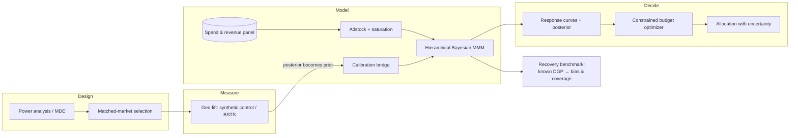

# liftlab

**Bayesian marketing mix modeling calibrated by geo-incrementality experiments — with a budget
optimizer that carries posterior uncertainty into the recommendation instead of discarding it.**

> **Status: in active development (v0.1.0).** The media transforms and the project spine are in
> place; the MMM core, geo-lift module, calibration bridge, optimizer, and recovery benchmark are
> not built yet. Sections below that depend on results say so explicitly rather than showing
> placeholder numbers. Nothing in this README is claimed until a named command produces it.

## Why

Post-ATT attribution is broken, and most agencies still sell last-click ROAS. Marketing mix
modeling is the standard answer, but MMM alone is only weakly identified: many combinations of
carryover, saturation, and channel coefficient fit the same aggregate revenue series roughly as
well. Fitting one of them and reporting it as truth is the common failure mode.

The fix is to calibrate the model against experiments. Geo-based incrementality tests give a
randomised (or quasi-randomised) estimate of lift for one channel over one window; that estimate
becomes an informative prior on the corresponding MMM coefficient. This is what Meta and Google do
internally, and it is rarely demonstrated end to end in public.

`liftlab` is that pipeline: **design the experiment → run it → fold its posterior into the MMM →
optimize the budget under uncertainty.**

## Architecture



## Results

**Not yet available.** The headline result for this repo is a **parameter-recovery and posterior
coverage table**: simulate a known data-generating process, fit the model, and report how far the
estimates land from truth and whether the credible intervals cover at their nominal rate. It will
be produced by `just recover` and published here with the command that generates it.

Until that benchmark has actually run, this section stays empty. A coverage table is the one thing
that distinguishes a model that was checked from a model that was merely fit, so it is not
something to approximate.

## Quickstart

```bash
git clone https://github.com/DataScientist13/liftlab.git
cd liftlab
just setup
just test
```

`just setup` installs dependencies with `uv`, wires up `pre-commit`, and installs the repository's
`commit-msg` guard. It works from a cold clone with no manual steps.

What works today:

```python
import numpy as np
from liftlab import geometric_adstock, hill_saturation

spend = np.array([0.0, 100.0, 100.0, 0.0, 0.0, 0.0])

# Carryover: effect persists after spend stops. normalize=True keeps total spend fixed,
# which decouples the decay parameter from overall effect size.
carried = geometric_adstock(spend, decay=0.6, normalize=True)

# Diminishing returns: half_saturation is on the spend scale, so it is prior-elicitable.
response = hill_saturation(carried, half_saturation=80.0, slope=1.5)
```

## Development

| Command        | What it does                          |
| -------------- | ------------------------------------- |
| `just setup`   | Cold-clone bootstrap                  |
| `just test`    | Full suite with coverage floor        |
| `just lint`    | `ruff check` + `ruff format --check` + `mypy --strict` |
| `just fix`     | Autofix lint and formatting           |
| `just recover` | Parameter-recovery benchmark (not implemented yet) |

Architecture decisions are recorded in [`docs/adr/`](docs/adr/).

## Demo data

The demo dataset will be **synthetic Israeli e-commerce**, not a scraped or borrowed real one:
Hebrew channel names, the Israeli holiday calendar (Pesach and Rosh Hashana retail spikes, Yom
Kippur hard zeroes, Ramadan effects in mixed markets), and a Saturday-trough weekly cycle. The
data-generating process is documented and seeded, which is precisely what makes the recovery
benchmark meaningful: ground truth is knowable.

## Limitations

Stated up front, because a measurement tool that hides its assumptions is worse than none.

- **MMM is not an experiment.** Even calibrated, it rests on assumptions about functional form and
  unobserved confounders. It narrows the uncertainty around incrementality; it does not eliminate
  it.
- **Geo-lift transfers imperfectly.** A lift estimate is measured for one channel, one creative
  mix, one time window, one set of markets. Using it as a prior for a global coefficient assumes
  that estimate generalises — an assumption that is often wrong when creative or competitive
  conditions shift.
- **Adstock and saturation trade off against each other.** Slow decay with early saturation can
  mimic fast decay with late saturation. Informative priors and the recovery benchmark are how this
  is managed, not solved.
- **Aggregate data limits resolution.** Weekly national data cannot separate channels whose spend
  moves together. Where correlation is high, the honest output is a wide posterior, not a
  confident number.
- **The optimizer extrapolates.** Recommended budgets outside the historical spend range sit on the
  fitted curve's extrapolation, where the model is least trustworthy.

## License

MIT — see [LICENSE](LICENSE).
