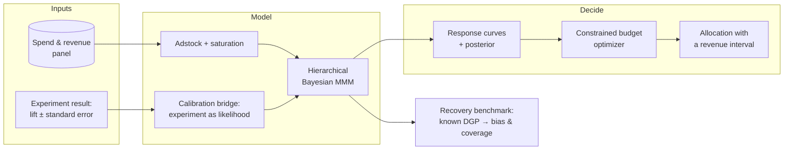

# liftlab

**Bayesian marketing mix modeling calibrated by geo-incrementality experiments — with a budget
optimizer that carries posterior uncertainty into the recommendation instead of discarding it.**

> **Status: in active development (v0.1.0).** The MMM core, the Israeli retail calendar, the
> synthetic DGP, the calibration bridge, the parameter-recovery benchmark, and the budget optimizer
> are in place. Designing or analysing geo experiments is deliberately out of scope — see
> Architecture. Every number below is produced by a named command, and nothing is claimed until it
> has actually run.

## Why

Post-ATT attribution is broken, and most agencies still sell last-click ROAS. Marketing mix
modeling is the standard answer, but MMM alone is only weakly identified: many combinations of
carryover, saturation, and channel coefficient fit the same aggregate revenue series roughly as
well. Fitting one of them and reporting it as truth is the common failure mode.

The fix is to calibrate the model against experiments. An incrementality test gives a randomised
(or quasi-randomised) estimate of lift for one channel over one window — external information the
aggregate series does not contain. Folding it into the model is what Meta and Google do internally,
and it is rarely demonstrated end to end in public.

`liftlab` is that fold: **take a lift measurement you already have → let it constrain the MMM →
read the budget implications with the uncertainty intact.**

The benchmark below quantifies what that buys, on data where the right answer is known.

## Architecture



**`liftlab` does not run or analyse the experiment.** It consumes the result — an incremental
revenue estimate with a standard error — from wherever the test was actually measured: a geo
holdout, Meta Conversion Lift, a Google geo experiment, an in-house synthetic control. Designing
and analysing geo tests is a separate problem with mature tooling, and reimplementing it here would
add surface area without adding evidence.

## Results

Simulate from a known data-generating process, fit the model, and check two things: how far the
estimates land from truth, and whether the credible intervals cover at their nominal rate. Twelve
independent replications of three years of daily data across five channels.

```bash
just recover --profile full
```

| parameter | n | bias (mean est.) | bias (median est.) | median abs rel. bias | coverage 95% |
| --- | --- | --- | --- | --- | --- |
| roas | 50 | **+5.2%** | **−1.1%** | 25.5% | 90% |
| beta | 50 | +18.2% | +7.9% | 20.7% | 98% |
| half_saturation | 50 | +38.2% | +17.2% | 33.8% | 98% |
| decay | 40 | +7.1% | +6.0% | 13.0% | 98% |
| slope | 50 | +4.8% | +0.2% | 19.8% | 100% |

Full report and per-replication raw data: [`docs/recovery/`](docs/recovery/).

An earlier version of this model showed a systematic **+26% upward offset** on ROAS. The cause was
diagnosed and fixed — the prior sat on the Hill asymptote, the least identified quantity in the
system, so it did the likelihood's work in the flat direction — by sampling each channel's realised
ROAS directly and deriving the asymptote from it
([ADR 0005](docs/adr/0005-roas-parameterisation.md)). Both point-estimator columns are reported
because the mean of a right-skewed posterior sits above its centre by construction; the median
column shows the estimates are now essentially unbiased in aggregate.

### Does calibration help?

The same twelve replications, refit with a simulated incrementality experiment on the two
highest-spend channels — a 42-day window with a 20% relative standard error. Channels were chosen
by spend rank before any results were seen, not by which ones fit worst.

```bash
just recover --profile calibrated
just compare
```

Paired over the 9 replications healthy in **both** arms, because the two exclude different seeds
for divergences and comparing their summary tables directly would confound the effect with a change
in which replications were counted. Each cell reads *uncalibrated → calibrated*:

| channel group | n | median abs ROAS error | coverage 95% | 95% interval width |
| --- | --- | --- | --- | --- |
| tested (search, social) | 18 | **12.8% → 8.5%** | 100% → 100% | 2.33 → **1.37** |
| untested | 27 | 41.5% → 39.8% | 81% → 85% | 3.00 → 2.73 |
| all channels | 45 | 26.2% → 21.0% | 89% → 91% | 2.52 → 1.59 |

**Calibration cuts the error on the channels you test by a third and narrows their intervals by
~40% without coverage degrading** — more precise, not merely more confident.

**It barely helps the channels you don't test.** Pinning one channel's contribution does constrain
what is left for the others to explain, but that spillover turns out to be weak. The practical
implication is unglamorous and worth stating plainly: you have to run the experiment on the channel
you want a trustworthy number for. Calibration is not a free lunch that a single test spreads
across the media plan.

**Read it like this.** Coverage is the number that matters. A 95% credible interval should contain
the truth about 95% of the time, and here it does — 90% for ROAS (within sampling error of nominal
at this replication count), 97–100% elsewhere. The intervals are honest: when this model says it is
uncertain, it genuinely is. A biased estimate with an honest interval is usable; a well-centred
estimate with overconfident intervals moves someone's budget on a number that was never that
certain.

**The aggregate offset is gone, but per-channel error is not.** The 25.5% median absolute ROAS
error is spread, not slant: it concentrates in the low-spend channels whose spend never approaches
saturation, where the data is weakest and the informative ROAS prior does the most work. The fix
for those channels is not more modeling — it is an experiment, which is what the table above
measures.

Carryover recovers best (13% median absolute error on decay), effect sizes worst. That ordering is
not incidental: carryover is identified by the *shape* of the response over time, which the data
constrains well, while effect size is identified by its *level*, which trades off against the
organic baseline.

**Two of twelve replications were excluded** for exceeding 2% divergent transitions, even at
`target_accept_prob = 0.95`. R-hat and bulk ESS were fine in every run — divergences were the only
failure mode. Down from four of twelve before the ROAS parameterisation, but not zero, and the
worst seed still diverges at 9.6%: see Limitations.

## Quickstart

```bash
git clone https://github.com/DataScientist13/liftlab.git
cd liftlab
just setup
just test
```

`just setup` installs dependencies with `uv`, wires up `pre-commit`, and installs the repository's
`commit-msg` guard. It works from a cold clone with no manual steps.

What works today — generate three years of synthetic data with known parameters:

```python
from liftlab import generate_panel

panel = generate_panel()  # 1,095 daily rows, five channels
panel.data.head()  # spend_search … spend_email, revenue
panel.truth.parameter_table()  # the parameters that produced it
panel.truth.roas  # realised true ROAS per channel
```

The transforms are usable directly:

```python
import numpy as np
from liftlab import geometric_adstock, hill_saturation

spend = np.array([0.0, 100.0, 100.0, 0.0, 0.0, 0.0])

# Carryover: effect persists after spend stops. normalize=True keeps total spend fixed,
# which decouples the decay parameter from overall effect size.
carried = geometric_adstock(spend, decay=0.6, normalize=True)

# Diminishing returns: half_saturation is on the spend scale, so it is prior-elicitable.
response = hill_saturation(carried, half_saturation=80.0, slope=1.5)
```

## Budget optimizer

Allocates a budget across channels over the fitted response curves, subject to a total and
per-channel bounds:

```python
from liftlab import ResponseCurves, optimize_budget

curves = ResponseCurves.from_posterior(idata, channels, data.spend_scale, data.revenue_scale)
plan = optimize_budget(
    curves,
    total_daily_budget=25_000,
    n_days=30,
    bounds={"tv": (2_000, 8_000)},  # contractual minimum, inventory ceiling
)

plan.to_frame()  # daily spend per channel
plan.expected_revenue  # posterior mean incremental revenue
plan.revenue_interval(0.95)  # and the range it could plausibly be
```

It maximises **the posterior mean of revenue**, not the revenue implied by the posterior mean of
the parameters. Those are not the same quantity — the response curve is nonlinear, so by Jensen's
inequality averaging curves and averaging parameters give different answers, and the second is
systematically over-optimistic about channels whose saturation is uncertain. Given the recovery
benchmark shows the point estimates are the least trustworthy part of the fit, collapsing the
posterior before optimising would throw away the only thing the Bayesian machinery bought.

Every allocation comes back with the posterior distribution of its incremental revenue, so a
recommendation can be reported as a range rather than a suspiciously precise number.

## Development

| Command        | What it does                          |
| -------------- | ------------------------------------- |
| `just setup`   | Cold-clone bootstrap                  |
| `just test`    | Full suite with coverage floor        |
| `just lint`    | `ruff check` + `ruff format --check` + `mypy --strict` |
| `just fix`     | Autofix lint and formatting           |
| `just recover` | Recovery benchmark (`--profile full` for the published run) |

Architecture decisions are recorded in [`docs/adr/`](docs/adr/).

## Demo data

The demo dataset is **synthetic Israeli e-commerce**, not a scraped or borrowed real one. Three
years of daily data across five channels with Hebrew names — חיפוש ממומן, מדיה חברתית, וידאו,
טלוויזיה, דיוור אלקטרוני — spanning fast carryover (search) and slow, delayed-peak carryover (TV).

Calendar effects are real, not decorative:

- **Saturday trough, Thursday peak.** The Israeli working week runs Sunday to Thursday, and most
  retail closes for Shabbat.
- **Pre-holiday surges.** A fortnight-long ramp into Pesach and Rosh Hashana, peaking on the eve.
- **Yom Kippur.** Commerce stops. Modelled as a supply-side closure applied to *total* revenue, not
  just the organic baseline — advertising that ran beforehand sells nothing on a day when nobody
  can buy.

Holiday dates are derived from the Hebrew calendar via [`pyluach`](https://pypi.org/project/pyluach/),
never hardcoded. The Hebrew calendar is lunisolar, so these dates move by weeks across Gregorian
years; a hardcoded table is how a project like this silently ships wrong seasonality.

The DGP is documented and seeded, which is what makes the recovery benchmark meaningful: ground
truth is knowable. Spend is deliberately generated with both daily variation and discrete campaign
flights, because a channel held at constant budget carries almost no information about its own
carryover or saturation.

## Limitations

Stated up front, because a measurement tool that hides its assumptions is worse than none.

- **MMM is not an experiment.** Even calibrated, it rests on assumptions about functional form and
  unobserved confounders. It narrows the uncertainty around incrementality; it does not eliminate
  it.
- **Ramadan is not modelled.** It shifts retail meaningfully in mixed and Arab-majority localities,
  but doing it properly needs the Hijri calendar and locality weighting, which means a geo-resolved
  model. Approximating it would be worse than leaving it out and saying so.
- **Lift estimates transfer imperfectly.** A lift estimate is measured for one channel, one
  creative mix, one time window, one set of markets. Feeding it into the model assumes that
  estimate generalises — often wrong when creative or competitive conditions shift.
- **The bridge trusts the experiment.** It treats the supplied estimate as unbiased and its
  standard error as honest. A geo test with contaminated control markets is biased, and the bridge
  will propagate that bias into the MMM with a straight face. The benchmark measures what
  calibration buys when the experiment is sound; it does not measure the cost of a bad one.
- **Adstock and saturation trade off against each other.** Slow decay with early saturation can
  mimic fast decay with late saturation. Informative priors and the recovery benchmark are how this
  is managed, not solved — the benchmark above puts the residual cost at a median 34% absolute
  error on half-saturation.
- **The ROAS prior is informative, and it shrinks extreme channels.** The near-zero aggregate bias
  is bought with a `LogNormal(log 1.5, 0.7)` prior on each channel's ROAS — defensible from
  published lift experiments, but a channel whose true ROAS is far from that centre gets pulled
  toward it: the benchmark's email channel (true ROAS 4.3) is estimated around 2–3 uncalibrated.
  For a channel you suspect is an outlier, the model's number is regularised, and the remedy is an
  experiment on that channel, not a wider prior ([ADR 0005](docs/adr/0005-roas-parameterisation.md)).
- **A sixth of fits are still discarded for divergences.** Two of twelve replications exceed a 2%
  divergent-transition rate (down from four before the ROAS parameterisation), and the worst seed
  diverges at 9.6%. The residual cause is the one ADR 0004 identified: for channels operated far
  below saturation, the saturation parameters are genuinely unidentified, and an earlier purely
  geometric fix was rejected for costing interval coverage
  ([ADR 0004](docs/adr/0004-saturation-reparameterisation.md)). Not something to run unattended yet.
- **Aggregate data limits resolution.** Weekly national data cannot separate channels whose spend
  moves together. Where correlation is high, the honest output is a wide posterior, not a
  confident number.
- **The optimizer extrapolates, and inherits everything above.** Budgets outside the historical
  spend range sit on the fitted curve's extrapolation, where the model is least trustworthy, and it
  optimises over curves whose per-channel error the benchmark measures at 25% median absolute. Read
  its allocations as directional, with the interval attached — not as a target to hit.

## License

MIT — see [LICENSE](LICENSE).
